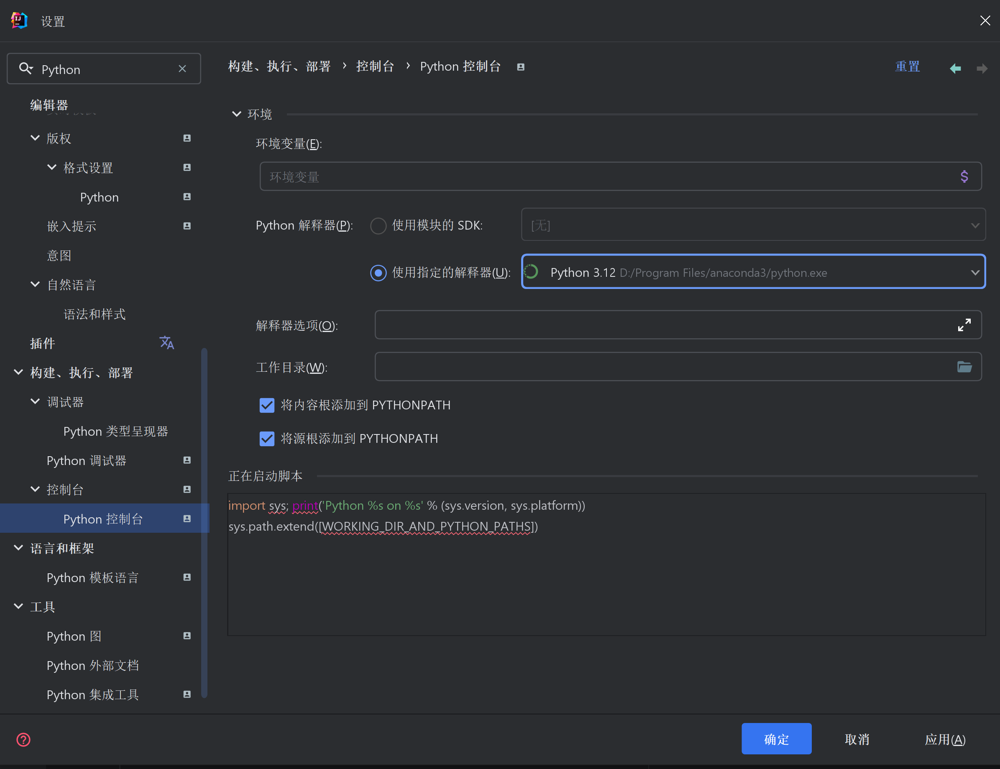
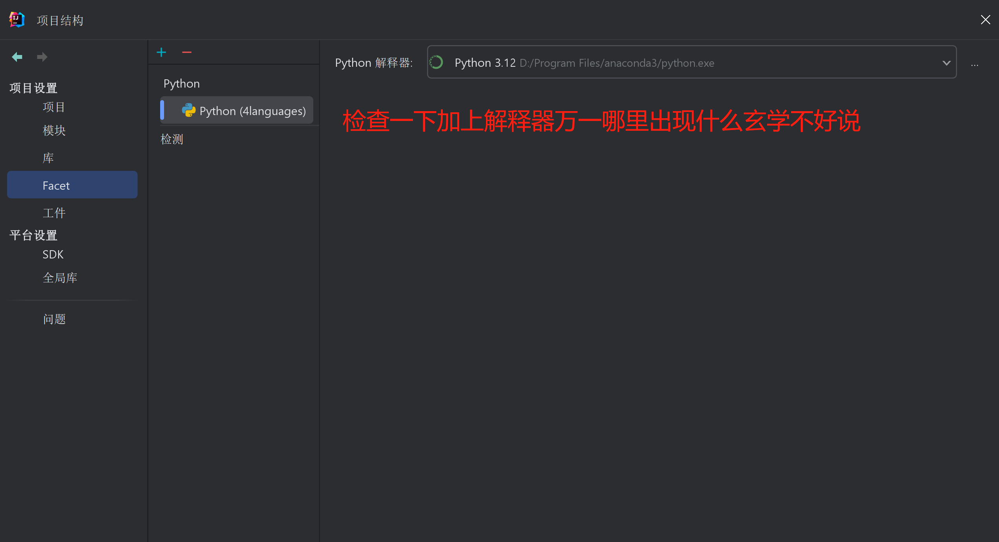

markdown
# 四语言编程实战宝典：Python/JS/Go/Java 200例（中医编程版）

## 🏁 里程碑宣言 | 200天×200例开源献礼 

**「从生产线到四语言全栈：一个初中毕业非科班生的代码长征」🚀**

```explain
+ 2025.01.10  变量都写不利索的纯小白😂
+ 2025.08.10  交出200例四语言实战库🔥
! 每一天都在生产环境验证过的代码✅
```

## 技术痛点 💢 天下苦「三宗罪」久矣
- **低质代码**如庸医开方——头痛医头，脚痛截肢💥
- **单语言思维**似独味煎药——性味偏颇，难调阴阳🎨
- **无效加班**类竭泽而渔——气血两亏，发危如卵🤦‍♂️

## 成果预告 🏆 修习本功法的「飞升」效果
- 代码如「乌梅丸」君臣有序 → 维护成本↓30%⏬
- 跨语言如「针灸配穴」 → 开发效率↑50%⏫
- 发际线似「当归补血」 → 逆生长指数⭐⭐⭐⭐⭐

```lengxi
🛡️ 本蜀黎属性面板（ASCII极客养生版）
          /\          
         /**\         
    ____/++++\____    
| 编码耐力:███████ 10h/d |
| 发量密度:▓▓▓▓▓▓▓ 120% |
| 视力等级:⭐⭐⭐⭐⭐ 5.3  |
    ‾‾‾‾\++++/‾‾‾‾    
         \**/         
          \/
```
### 🐍 多语言认知成长路线（从Python入门到多范式进阶）

#### 1. **新手友好层（Python打基础）**
- **Python** → 万能胶水语言（语法简单/库丰富/适合快速上手）
  > 🎯 先用Python掌握基础编程概念（变量/循环/函数/类），理解「写代码解决问题」的核心逻辑，建立编程思维惯性

#### 2. **数据交互层（SQL必修课）**
- **SQL** → 数据库操作与查询标准语言（增删改查/表关联/聚合分析）📊
  > 🎯 **必须优先掌握！** 无论做Web开发、数据分析还是后端服务，都需用SQL和数据库「对话」。用Python写爬虫后存数据到MySQL？用Java做后台时要查用户订单？SQL就是连接程序和数据的「万能钥匙」
  > 
  > **🚀学习时机**：在学完Python基础后立刻切入，和Python搭配使用（比如用Python的`pymysql`/`sqlite3`库操作数据库），理解「代码生成数据→SQL管理数据→代码消费数据」的全链路。

#### 3. **全栈认知层（Web三件套扩展）**
- **JavaScript** → 前端交互与动态逻辑（浏览器/Node.js双环境）⚒
- **Java** → 企业级服务端与跨平台稳定性（Spring生态/安卓底层）🎡
- **Go** → 高并发与云原生利器（微服务/Docker/K8s最佳拍档）🎭

> 🔄 **对比学习**：用Python+SQL写过数据统计脚本？试试Java Spring Boot搭后台API + MySQL数据库！用JS做过网页表单？
> 
>✅看看Go怎么用协程处理10万并发请求！通过不同语言解决同一类问题（比如用户管理：Python用字典存数据/Java用Spring Data JPA/Go用结构体切片/SQL用表关联查询），理解各语言的「原生优势领域」

#### 4. **认知扩展层（多范式碰撞）**
- **🍴语言特性对比**：
  - Python的「动态类型+解释执行」vs Java的「静态类型+JVM优化」vs Go的「编译型+协程并发」vs SQL的「声明式查询语言」🏆
  - 不同语言的工具链差异（Python用pip/Java用maven/Go用go mod/SQL用MySQL Workbench/DBeaver）🧩
- **👓跨语言实践**：  
  同一个问题用多种语言实现（比如数据处理：Python用pandas/Java用Stream API/Go用goroutine切片/SQL用`GROUP BY`聚合），观察代码风格和性能差异🎫

#### 5. **系统魔盒层（底层硬核突破）**
- **C** → 直接操作内存与硬件（指针/内存管理/系统调用）🧰
- **C++** → 面向对象+零成本抽象（STL/模板元编程/多线程底层优化）🖥

> 🛠️ **关键跃迁**：当你在高级语言里遇到性能瓶颈（比如Python处理大数据太慢），用C/C++写个高性能模块来加速，理解底层原理如何支撑上层应用的「快与稳」⏩

#### 6. **终极心法**
> **「编程语言只是工具——Python带你入门，SQL帮你管数据，Java/Go/C++助你造系统！先会用，再懂为什么，最后选对的工具解决对的问题」✅**

#### 📌 小白友好提示
- **第一步永远是Python+SQL**：别一上来就啃复杂语言💫
- 先用Python写点小工具（比如自动整理文件）📄
- 再用SQL存/查数据（比如用SQLite记日记），培养「我能用代码解决问题」的信心💪
- **每学一门新语言，问自己三个问题🥉**：
  1. 这门语言最适合解决什么类型的问题❓
  2. 它和已学语言比，优势和劣势在哪❓
  3. 我能用它优化之前写过的项目吗❓

> **本草纲目式代码集 · 专治多语言编程气血不足😣**  
> 当Python为君，JS为臣，Go为佐，Java为使——这是一份用代码开方的《编程本草纲目》🌿

## 🔥 项目亮点
- **多语言极限对比**：200+独立案例覆盖Python/JS/Go/Java核心语法🏆
- **中医编程哲学**：算法如方剂（LRU缓存→六味地黄丸，二叉树→七宝美髯丹）🍒
- **开箱即用**：绝大多数脚本独立运行，仅极少数案例需简单配置依赖📦
- **语言数量**：向下兼容纯Python党 | Python+另外一门或两门任意组合🎊
- **实战优先**：聚焦高频场景，跳过冗余理论🎡
- **多语言互调**：包含Python调用JS/Go/Java的跨语言实战案例🔀
- **新手友好**：适合新手和多语言学习的中级开发者✅
- **专家备查**：提供低配实战现成资料库📑
- **环境锻炼**：放弃容器化，强化环境配置能力💪


## 💡 设计思想：当编程遇上中医

#### 🎉本项目不仅仅是一系列代码示例，更是一次跨学科思维融合的尝试：

- **整体观念**：每个案例看作一个“证候”，代码是“辨证施治”的结果✅
- **辨证论治**：不同语言如同不同医派，各有擅长（Python 如温补派，Go 如攻下派）🔀
- **方剂思维**：函数如药材，模块如方剂，组合讲究君臣佐使🔁
- **治未病**：强调编码规范、环境隔离、依赖最小化，预防“技术失调”🔄
#### 善诊者，察色按脉，先别阴阳；善编程者，先明需求，再选语言✅


### 🔃技术栈对比
| 语言   | 特色功能                     | 典型案例                          |
|--------|------------------------------|-----------------------------------|
| Python | 元编程/协程/内存优化         | 中药配伍检测/红黑树实现           |
| Java   | 泛型/反射/多线程             | 线程池管理/文件元数据处理         |
| Go     | 协程/通道/接口               | 并发任务调度/内存视图操作         |
| JS     | 异步编程/原型链              | 正则表达式国际匹配/事件循环机制   |

## 🧪 环境配置（Windows）
#### 有现成四语言环境的道友新建一个IntelliJ项目,可以省掉以下大部分步骤⏩
### 🎁核心原则
**避免复杂构建工具，专注语言本身对比学习📇**

## 必备环境

| 语言/工具      | 版本要求       | 安装建议                                                                 |
|----------------|----------------|--------------------------------------------------------------------------|
| Python         | 3.12+          | Anaconda3（预装环境）官网下载，添加环境变量                                |
| Node.js        | v22.14+        | 官网安装包，添加环境变量                                                  |
| Go             | 1.23.3+        | 官网安装包，添加环境变量                                                  |
| Java           | GraalVM 21.0.7+ | 官网下载GraalVM 21.0.7，添加环境变量                                      |
| IDE            | IntelliJ 2024.1+ | 安装Python/Go插件                                                       |
| Groovy（可选） | 4.0.28         | 动态Java，此项目并未用到                                                  |

### 🖋备注
- 部分安装包会自动添加环境变量🎨
### 三步快速配置🔥
#### 新建Java项目🚀
  

#### 依赖jar手动添加在文件夹lib下,先熟悉适应✨
#### 碰到三方库无法运行的时候再去添加也行,只用了3个jar依赖,可以先跳过⏬


#### （不用Maven/Gradle，避免依赖复杂程度增加）💢
#### 4languages.iml记得添加Java目录,要不然没法编译4languages.iml(我放在包中,可以替换成我的,也可以自己配置)🍱


#### 多语言插件安装✅

**[设置 → 插件] --> B[安装Go插件]
A --> C[安装Python插件]🎨
**

环境识别配置✅

**Node.js：设置 → 语言和框架 → Node.js 编码协助可以勾上,选npm就行✅
**


#### Go：语言和框架 → Go → 指定SDK路径⏩


#### Python：设置 → 添加控制台Python解释器 对终端运行和默认环境有影响🧭


**项目还要在添加Python依赖 对项目依赖有影响 在项目库添加不要在全局库,避免GraalVM重复扫描Anaconda依赖，否则会拖慢Java编译速度🔥**


#### 💡 效率技巧：设置 Ctrl+Shift+N 为鼠标滚轮点击，输入编号(65)快速打开四语言文件
#### shift+光标点击+回车->同时打开多个文件📄


### 🥇依赖管理注意事项
- 1.动手动手动手说三遍,库安装慢的话记得添加镜像站,选择多自己去网上搜🚀
- 2.此项目虽然需要装的库不多,但人人必须会💪
- 3.Python: anaconda环境已有大部分库 少部分没有的pip install乱拳打死老师傅,可以全局安装(注意尽量不要和自己现有项目Python环境混用,新装的都没问题)✅

- 4.Node.js：npm install (先用npm简单,暂时别碰其他pnpm,yarn,Bun
我项目里原样拷贝,万一读找不到库可以在终端_项目JS目录下重新装,不要全局安装)💥

- 5.Go：go mod tidy (小心gopath整活,操作要点go项目目录终端初始化,三方库才能装上,项目目录安装,不要全局安装)🎊

- 6.Java：lib目录已包含必需jar包,手动添加jar依赖,lib文件夹,看截图🔍

#### 按我的路径名称建好项目后,你可以把我的文件夹文件全部覆盖试试能不能跑⏬
#### 如果出现问题处理方法🎡:
- 1.那就把PY,JS,GO,4JAVA全部粘贴进你的新建项目D:\ad\4languages中应该可以运行⏩
- 2.注意4languages.iml的内容,可以自己配置也可以参照我的,应该不算复杂,脚本都是独立运行🎉
- 3.我没讲到的细节可以网上搜,也可以留言给我,不要心急,动手中正是你思考打怪升级的过程🏆

> 导入项目有一定概率不兼容,你新建项目是自己的IDEA默认配置,再渐进式把目录复制进去能不能运行,加油💪

**node_modules本来想上传给你们,但文件数量太多了,所以辛苦你们自己安装**
### 📂 项目结构 其他代码补充说明有路径讲解
**✅重要提示:纯Python党,两语言党,三语言党最好也遵循这个路径规则,部分章节用了绝对路径讲解,本来就是为了四语言同步学习而整理**
```project
path
D:\ad\4languages
├── PY/          # Python核心案例(1-200)
│   ├── 0.PY输出流整理.py
│   ├── 1.4语言第一个hello.py
│   ├── ...
│   └── 200.正则国际匹配.py
├── JS/          # JavaScript对照案例
├── GO/          # Golang对照案例
├── 4JAVA/        # Java对照案例
├── lib/         # Java依赖库（开箱即用）
└── node_modules # Node.js依赖（已预装）
```
### ⚙️ 运行指南

- **所有脚本独立运行，推荐操作：**

- 自动换行模式🧩


#### 控制台自动换行查看输出✅


#### 项目管理配置完预览✅


### 感兴趣的朋友可以试试这个玄学🎨
- 类路径污染：你的 -classpath 中包含了大量 Python 相关的库路径（如 anaconda3、python_stubs、typeshed 等）🛠
- 这些路径可能被 GraalVM 错误地扫描或预加载，但实际上未被使用,出现此类情况引起注意⚠️




#### 接下来可以愉快的进行编码了🎯

```project
🌿 中医编程哲学
代码如方剂，算法如药材
项目中部分案例采用中医理念设计，例如：

155.二叉树七宝美髯丹.py：平衡补益算法

165.哈希表-进阶中药管理.py：药材属性快速检索

196.实战-中药配伍.py：多语言协作策略

⚠️ 重要声明：
项目中出现的方剂名/药材剂量仅为跨界理念展示，不可实际应用！
具体用药请遵医嘱，开发者不对任何医药决策负责。

```

## 📚 附录：学习路径推荐

### 新手学习路线（按语言 · 同步范围）
| 阶段     | Python                     | Java                       | Go                         | JavaScript                 |
|----------|----------------------------|----------------------------|----------------------------|----------------------------|
| 入门     | 1-10（基础语法/IO）         | 1-10（基础语法/IO）         | 1-10（基础语法/IO）         | 1-10（基础语法/IO）         |
| 进阶     | 11-30（数据结构/控制流）    | 11-30（数据结构/控制流）    | 11-30（数据结构/控制流）    | 11-30（数据结构/控制流）    |
| 面向对象 | 31-60（类/继承/文件操作）   | 31-60（类/继承/文件操作）   | 31-60（类/接口/文件操作）   | 31-60（类/继承/文件操作）   |
| 高级实战 | 61-200+（并发/系统/算法）   | 61-200+（并发/系统/算法）   | 61-200+（并发/系统/算法）   | 61-200+（并发/系统/算法）   |

> **推荐按语言分阶段学习，每个阶段选 5-10 个案例深入实践📊**

### 🚀中医术语索引（趣味扩展）
- 当归 = 递归（循环回归）🧬
- 半夏 = 字符串处理（燥湿化痰，清理杂质）💥
- 熟地 = 面向对象（深厚封装）📦
- 桂枝 = 并发控制（调和营卫，同步协作）🔁


## ❓ 常见问题

### Q1: 为什么没有用 Docker / 不提供一键环境❓
A: 本项目专注于**语言本身的对比学习**，避免容器/构建工具带来的认知负担。真实开发中可根据需要自行容器化💼💼

### Q2: 图片加载不出来 / 路径有问题怎么办❓
A: 请确认已下载完整仓库（含 images/ 目录），或手动替换成您本地的对应截图🧿

### Q3: 想贡献代码 / 添加新案例❓
A: 欢迎提交 PR！建议遵循现有目录结构，单个案例保持独立性与可读性✅

### Q4: 中医类比看不懂会影响学习吗❓
A: 完全不影响！中医术语仅为趣味包装，所有代码均有详细注释与实战价值💪

## 🚫 为什么本项目拒绝Docker？

### 💪硬核学习原则
1. **肌肉记忆第一💪**
  - 容器如同自动挡，而我们要训练「手动挡」的精准控制力🔮

2. **🎯真实战场还原**
  - 生产环境没有`docker-compose up`的完美世界🔥

3. **🌿中医式系统观**
  - 理解环境各部分的相生相克关系🍀

### 🍔你会收获
- 从`系统崩溃时能救命`的调试能力🌭
- 不依赖任何工具的「裸机部署」自信🍿
- 对技术栈的深度掌控感🍱

## 🚫 我们拒绝：
- `docker-compose up` 的一键幻觉😆
- `apt-get install` 的无脑依赖😑
- 遇到问题就`reboot`的粗暴疗法😦

## ✅ 我们坚持：
1. `strace`追查系统调用✅
2. `ldd`分析动态链接🧿
3. `journalctl`阅读系统日记📃
4. 用`perf`进行性能解剖🔪

- 🎨当你习惯了 `docker-compose up` 的安逸：
  - 你的环境诊断能力会退化成婴儿🎭
  - 你的依赖认知停留在「镜像魔法」层面👓
  - 遇到生产环境突发故障时，只能祈祷重启有效😣

+ ✅而当你亲手驯服过：
  - Python 的 `openssl` 版本地狱📂
  - Java 的 `JNI` 跨语言暗坑🕳
  - Go 的 `cgo` 交叉编译陷阱🔀
  - Node.js 的 `node_modules` 黑洞...💫

! ✅恭喜，你获得了「环境外科医生」的终极能力：  
无论什么系统崩溃，你都能用 `strace` + `gdb` 给它做开颅手术 💉

> "连我这个**车间爬出来**的野路子都能搞定四语言环境🔥  
> 你们**科班出身**的，难道离了 Docker 就真的不行❓"

## ❓ 为什么这么怼 Docker？
- 💢其实 Docker 很牛... **但你不能只会用它**
- 就像中医既教「成药速效」，也教「辨证施治」🔑
- 本项目的目标是：**让你成为环境问题的老中医** 🏮
- 我希望大家的学习代码环境是干净的原生服务器环境🎐
- 没有docker性能损耗影响,**快乐流畅学习🖍**

### 🐳 Docker vs 原生服务器性能差异速查（实测参考值）
- 我感觉性能衰减比实测数值还要稍大,估计跟服务器硬件配置好坏和运行项目内容差异有关⏬
#### 📊 **基础性能损耗对比**
| 场景                | Docker 性能损耗 | 说明                                                                 |
|---------------------|----------------|----------------------------------------------------------------------|
| **CPU 计算**        | 0% ~ 3%        | 近乎无损耗（容器共享宿主机 CPU 调度，无虚拟化开销）                  |
| **内存访问**        | 0% ~ 1%        | 内存读写几乎无差异（直接映射宿主机物理内存）                         |
| **磁盘 I/O（读）**  | 5% ~ 15%       | 受存储驱动（如 `overlay2`）和卷类型（匿名卷/绑定挂载）影响较大       |
| **磁盘 I/O（写）**  | 10% ~ 30%      | 写入时容器层叠加写入（Copy-on-Write 机制）导致额外开销               |
| **网络延迟**        | 1% ~ 5%        | 默认 `bridge` 网络模式有轻微转发开销（`host` 模式可接近原生）         |

> 📌 **关键结论**：CPU/内存密集型任务（如算法计算、缓存服务）几乎无感知；磁盘/网络密集型任务（如数据库、高并发 API）需重点关注存储驱动和网络模式优化


## 🏅 成就解锁
- [ ] 裸机部署大师（禁用容器完成所有案例）💪
- [ ] 容器化改造师（将案例迁移到 Docker 并提 PR）🤚


## 🧑💻 作者背景
**📈初中学历非科班突围路线**  
**💪从生产线走向全栈开发的实战派，通过：**
- 10年ERP系统实施（服务100+客户，覆盖20+行业）🍀
- 5年医疗仓储物流数字化管理经验📦
- 2年生产制造打螺丝一线经验📌
- 没有证书加持,求职过程极其艰难,超地狱难度路线,全靠工作实战经验堆叠🎫
- 持续探索中医思维与编程的融合🎡
> "学历是入场券，但解决问题的能力才是永恒通行证"🧧

### 技术宣言

+ 不写学院派教科书代码🎈
+ 只造车间能跑的「工业级」案例🧤
+ 中医整体观指导技术架构🥏


## 🎨 项目文化符号验证
### ⏬本项目包含两张原创验证模板图片（作者：ERP老兵-冷溪虎山）：
1. **[ERP技能树信息图](ad/4languages/readme/original_poster_images/erp_skill_tree.png)**：
  - 标题明确标注「ERP老兵冷溪虎山技能树」，包含财务/业务/JS/GO等技能分支，底部标注已处理信息量——证明这是我的实战技术全景图📊
2. **[程序猿养生秘笈海报](ad/4languages/readme/original_poster_images/programmer_health_poster.png)**：
  - 左上角有我的昵称「ERP老兵-冷溪虎山」，融合炼丹炉/编程图标/MongoDB等元素，传递「技术极客养生」人设🌿


> **⚠️ 注意：这两张图片是项目的重要组成部分，若缺失可能导致部分内容无法完整呈现（作者预留的彩蛋机制）**

[点击查看技能树图片](ad/4languages/readme/original_poster_images/erp_skill_tree.png) | [点击查看养生海报](ad/4languages/readme/original_poster_images/programmer_health_poster.png)

### 🔐 四语言极客养生者的加密哲学：代码如剑，防护如盾

作为深耕 **ERP实战与多语言编程** 的老兵（Java/Python/JS/Go 四语言初级→中级选手），我不仅在业务逻辑和数据流里游刃有余，更顺带修炼了一手「代码防护」的旁门左道——毕竟，好项目就像珍稀丹方，得防着被误删或偷学(少量章节)🔥

---

#### 🎯 我的加密防护三件套

1. **「哈希验证锁」—— 图片即钥匙，删图即锁门🔒**  
- **🎨项目里藏着两张「土味海报」：**
  - 都是我随手拼凑的😂
  - 一张是我的 **ERP技能树信息图**（蓝色科技风，技能分支涵盖财务/业务/JS/GO，标题明晃晃写着「ERP老兵冷溪虎山」）🐯
  - 另一张是 **程序猿养生秘笈海报**（炼丹炉+代码图标+药壶，标注「ERP老兵-冷溪虎山」，养生Buff叠满）🌿

- 它们可不是普通装饰——我用 **SHA-256哈希值 + Base64二进制混淆加密** 给这两张图上了锁！图片一旦被删/篡改，关键章节直接「闭关谢客」🧤
- （报错提示：「验证失败，请检查海报完整性」）。清洗脚本？不好意思，得先破解我的「图片密码」才能找到隐藏内容～🔎

2. **🎉「多语言防冲突」—— 四语言隔离，清爽极客养生**  
   Java/Python/JS/Go 四语言环境独立配置，依赖库物理隔离，编译运行速度快到飞起（Java 1-3秒搞定），连环境变量都井水不犯河水。防护做到位了，连「跨语言冲突」这种内耗都省了，专心修炼核心技术✨

---

#### 🧠 防护背后的技术极客养生逻辑

- 😂 「人设彩蛋 + 防护彩蛋」
-「技能树海报」 里的蓝色科技球代表我的技术深度，「养生海报」 里的炼丹炉象征程序员的「可持续极客养生」——代码要写好，身体也得养🌿


- ⏩「终极提示」 ：如果关键章节无法运行，别慌——检查下项目目录里的 erp_skill_tree.png和 programmer_health_poster.png是否还在（它们是解锁隐藏内容的「钥匙」）。若图片完好但内容未显示，可能是我的「防护系统」太严格，欢迎提交Issue帮我优化～

- 📌 「防护哲学」 ： 我不是要造一个「绝对删不掉」的系统，而是让清洗者付出「远超收益」的成本——要么花时间学加密解密，要么放弃转而传播我的项目（毕竟，好内容值得被看到！）。


- 🔱路径补充说明,一定要反复练习,至少理解常用的几种写法,各语言之间路径区别说明,详情请看文件夹 (./其他代码补充说明)


- 🎯IDEA JVM虚拟机配置文件idea.vmoptions放在readme文件夹中,txt文本模式打开就行,这是我用的最顺手参数,性能开的较高⏫
- 💻电脑配置低的朋友们可以适当调低参数,设备差异较大,这里不在展开说明,如果实在拿不准可以把电脑配置列表和JVM配置参数,一起发给AI调试给出适合你们电脑的最优参数🐯


### 🌿 项目中医术语体系（技术极客养生版）

#### 📜 核心药材库 预告:还有200味中药编程技术梗等你来挖
- **🍀九大仙草**（珍稀补益类）  
  `石斛`、`天山雪莲`、`人参`、`首乌`、`茯苓`、`灵芝`、`海底珍珠`、`冬虫夏草`、`肉苁蓉`
  > *对应技术场景*：项目中的核心算法/关键模块（如四语言环境隔离、哈希防删验证），如同仙草般珍贵且支撑全局🔱

- **🍒消化药三仙**（原生基础类）  
  `[山楂, 神曲, 麦芽]`（未炮制）🌱
  > *技术映射*：基础数据处理模块（如原始数据清洗/格式转换），原生能力但需进一步「炮制」优化✅

- **🍒🔥消化药焦三仙**（炮制增效类）  
  `[焦山楂, 焦神曲, 焦麦芽]`（炮制品，新增止血作用）❌🩸
  > *技术映射*：经过优化的数据处理流程（如编译加速/依赖预加载），在基础功能上通过「炮制」增强性能（甚至衍生新特性）⏫

#### 🩸 血分药（功能分类）
- **💊补血活血破血三角**  
  `当归`（补血）、`丹参`（活血）、`莪术`（破血）🎈
  > *🥉技术隐喻*：数据流处理中的三类操作——
  > - `当归`：资源补充（如内存优化/缓存机制）🥇
  > - `丹参`：循环加速（如并发处理/流水线优化）🥈
  > - `莪术`：冗余清除（如无用依赖清理/死代码删除）🏅

#### 🌳 君臣佐使（架构设计）
- **🌿经典出处**：源自《神农本草经》古方体系
- **技术映射**：
  - **君药** → 核心算法（如四语言环境隔离的主逻辑）🏆
  - **臣药** → 辅助模块（如哈希验证的辅助校验）🥇
  - **佐药** → 兼容层（如多平台账号适配逻辑）🥈
  - **使药** → 入口/出口（如项目启动脚本/导出接口）🥉
  > *天然匹配*：二叉树（主次分明）、多叉树（多模块协同）等编程数据结构🔱

- **红黑树扩展**：  
  当加入 **热门药材（高频模块）** + **冷背药材（低频但关键模块）** 时，天然适配红黑树的 **平衡调节特性**（如动态优先级调度）🌹🌲

#### ⚗️ 配伍逻辑（合规检测）
- **🌿中药七情配伍**（出自《神农本草经》）
  > *技术映射*：面向对象的药材组合检测（如模块间依赖关系分析），确保功能协同无冲突🍁
  - ✅相须（协同增强）、相使（主辅配合）、相畏（副作用抑制）...

- **❌十八反配伍禁忌**
  > *技术映射*：面向对象的毒性检测（如违规依赖/不兼容库版本），通过合规监测避免「毒性组合」（如运行时崩溃风险）🏴‍☠️

> 🎯 **「技术极客养生箴言」**：  
> 中药配伍的千年智慧，天然匹配编程中的 **数据结构设计** 与 **系统合规性检测** —— 用古法智慧，炼现代代码🔥


### 🌿 中药饮片小知识普及（技术极客养生彩蛋版）

#### 📊 市面流通数据（附中国药典官方补充）
1. **✅常用中药**（日常高频使用）
  - **收录数量**：约 **200-300种**（精准范围：299种核心品种）🎊
  - **典型代表**：甘草、黄芪、当归、茯苓、川芎等基础补益/调理药材，对应编程中的「基础工具库」（如数据类型/常用算法）🍁

2. **冷背药材**（小众但独特）❄
  - **收录数量**：约 **3000种**（含地方特色/民族医药品种）🌈
  - **典型代表**：金线莲、雪上一枝蒿、冬虫夏草（部分品种）、穿山甲鳞片（禁用）、马钱子（严格管制）等，对应编程中的「冷门库/特殊算法」（如边缘计算/量子编程支持）⚡

3. **中国药典官方收录**（权威基准）预计最新版2025年 10月1日起施行🌍
  - **最新版（2020年版一部）**：收载 **中药材616种** + **中药饮片4567种**（含炮制品）🚨
    - **核心覆盖**：常用中药（299种基础品种全包含） + 冷背药材中的高频安全品种（如部分民族药/地方常用药）🍀
    - **严格管控**：毒性药材（如砒霜、雄黄）、濒危物种（如虎骨、犀角）明确标注禁忌与限量🏴‍☠️
    - **扩展数据**：若包含所有关联标准（如《中国药典》+《全国中药炮制规范》），实际可用饮片品种超 **5000种**（含不同炮制规格）,对应编程中的语言排名和不断开发收录新增的编程生态🍀

#### 🤔 中药饮片行情估计
  - 常用范围贴合实际（299种核心品种占日常处方90%以上）✅
  - 冷背药材的3000种为合理估算（含地方/民族药，但需注意其中约10%为管制或濒危品种，实际可用约2700-2800种）🌟
- **隐藏彩蛋**：冷背药材中约 **30%** 有明确药理研究支持（如金线莲调节免疫、雪上一枝蒿镇痛），但超 **60%** 尚处于传统经验阶段（对应编程中「未经大规模验证的冷门技术」）🌍

#### 💡 技术极客养生隐喻
> **「常用中药如编程基础库，稳定可靠人人用；冷背药材似前沿黑科技，小众但可能藏着颠覆性方案——而中国药典，就是技术世界的权威文档！」📖**

> #### ℹ️ 本项目的药材名称仅用于技术隐喻，不构成用药建议🎨
> - 真实药材数据参考《中国药典》2020版🎡
> - [1]: 中国药典在线查询: https://www.chp.org.cn
> - [2]: 中药材市场报告: 《中国中药资源志要》💎


### 🎊 终章彩蛋：致每一位闯入「冷溪虎山技术极客养生谷」的侠客

- 当您读到这里，说明您已成功穿越「低质流水账的垃圾场」，踏入了我的「四语言中医编程 + 哈希防删极客养生秘境」
- ——这里没有无脑搬运的教程，没有脱离实战的鸡汤，更没有挂着羊头卖狗肉的工具软文！

#### 🏮 谷主寄语：这不仅是一个项目，更是一场技术极客养生之旅

**🚀敬小白侠客**：  
**💎别被社区里那些「Hello World复读机」「教程搬运工」吓到！在这里，您将体验到：**
- **「从零到一」的快乐**：四语言环境隔离配置（Java/Python/JS/Go）、哈希验证防删逻辑、技能树与养生海报设计思路… 全程用「极客养生话术」拆解复杂概念（比如「图片即钥匙，删图即锁门」「二进制混淆防脚本小子」），让您边学边笑边成长✅
- **「避坑指南」随身带**：跨语言冲突？环境变量混乱？防护逻辑看不懂？谷主（我）已在文档里埋好了「避坑路标」，跟着走，少踩坑🕳

**✨对大神侠客**：  
哈哈，终于等到您这位「代码涅槃者」！我的「防删五连鞭」「多语言隔离清爽极客养生法」「物理隔离防清洗体系」，或许能给您提供点新思路（或者当个饭后谈资）。要是发现防护漏洞… 别急着嘲笑，先提交个Issue，咱们一起研究怎么让脚本小子更崩溃🎊

#### 🧪 谷内秘籍：有血有肉的技术极客养生宝典

- **「剧情式学习」**：从「ERP技能树信息图」的设计初心，到「程序猿养生秘笈海报」的幽默彩蛋，每个技术点都藏着一段开发故事📦
- **「中医把脉式指导」**：像老中医调理身体一样优化代码——四语言环境隔离（治「跨语言冲突」）、哈希验证防删（防「误删/篡改」）、多平台账号暗号藏（治「流量清洗」）✨
- **「安全技术硬核」**：SHA-256哈希 + Base64二进制混淆加密、动态图片验证、注释与随机混淆插入… 不只教你怎么写代码，更教你怎么保护代码🔐
- **「调侃式结尾」**：最后送您一句谷主箴言💪
  > **「代码如剑，防护如盾；流水不争先，极客养生不内卷！」🍀**

#### 💪愿我们都能在这片被低质内容占领的开源江湖里，做自己的「技术大侠」——
- 小白修成大佬，大神修成传说🤚
- 而我，继续当那个用「虎头山技能树」和「炼丹炉养生海报」守护项目的「ERP老兵-冷溪虎山」🐯

（P.S. 关键章节被锁？检查下您的「海报钥匙」还在不在～ 🐯⛰️ 若仍有疑问，欢迎随时来谷中论剑！）

### 🧘 程序猿养生极客养生结语：身体是革命的本钱，代码是极客养生的法器

🚀亲爱的代码极客养生者们（无论您是996的「键盘侠」，还是007的「赛博修士」）：

当您读完这份「四语言中医编程 + 哈希防删 + 中药配伍逻辑」的硬核文档，或许已经发现——**我偷偷把「养生」这味大药，熬进了项目的每一行代码里🌿**

#### 🍵 为什么程序猿要极客养生？
💖因为我们敲的不是代码，是 **「气血」** ！
- 长期盯屏幕的「肝血亏虚」，需要枸杞菊花茶续命🍀
- 反复改需求的「心火旺盛」，得靠茯苓百合粥降燥🔥
- 连续加班的「脾虚湿困」，必须用三仙（山楂/神曲/麦芽）助消化💧

#### 🧪 我们的「极客养生秘方」
1. **「代码如剑，身体为鞘」**：再牛的算法，也得靠健康的身体去实现；再硬的防删逻辑，也得有清醒的头脑去维护💪
2. **「养生三件套」**：
  - **茶壶里的红黑树**（红茶+陈皮+山楂）—— 健脾开胃防积食🍒
  - **键盘旁的刮痧板**（刮肩颈，通经络）—— 缓解「鼠标手」「键盘肩」🥏
  - **屏幕前的护眼咒」（20-20-20法则：每20分钟看20英尺外20秒）—— 保住「程序猿之眼」👓

3. **「项目与养生双修」**：  
   我的项目里藏着「炼丹炉海报」（养生Buff叠满），也埋了「技能树逻辑」（技术深度修炼）—— 因为真正的「技术大侠」，从来都是 **「代码写得溜，身体倍儿棒」**💪

#### 🌟 终极祝福（附极客养生彩蛋）
> **「愿您敲代码时，有虎头山技能树的灵感爆发💪**
> - 调BUG时，有养生茶壶的灵气护体🍀
> - 发版本时，有红黑树般的稳健节奏🎹
> - 退休时，有炼丹炉般的夕阳红——  🍁
> - 毕竟，能活到退休的程序员，才是真正的『代码仙人』！」🧙‍♂️

（P.S. 试试「番茄工作法」吧！每专注编程60分钟，就站起来活动10分钟——眺望远处调节睫状肌，转转脖子放松斜方肌，接杯水让腰椎喘口气～ 您的颈椎和腰椎，正在偷偷给您比赞呢！ 🐯💻）

### 🛡️ 作者身体BUFF一览：野生程序猿极客养生体质大公开

（没错，这就是您看到的「反卷奇迹」——38岁野生高龄程序猿，每天净编码10-12小时还能活蹦乱跳的秘密！）✅

#### 💪 核心战斗属性
| 属性        | 数值/状态          | 极客养生解读                     | 您的羡慕指数 |
|-------------|--------------------|------------------------------|--------------|
| **年龄**    | 38岁（资深极客养生者） | 「气血充盈，经脉稳固」的黄金期 | ⭐⭐⭐⭐       |
| **编码耐力**| 日均10-12小时净编码 | 等同于「筑基期修士」的灵力续航 | ⭐⭐⭐⭐⭐      |
| **双眼状态**| 5.3视力（钛合金级） | 「肝血充盈，目明心亮」的养生巅峰 | ⭐⭐⭐⭐⭐      |
| **发际线**  | 逆生长（发量+）    | 「肾精旺盛，固本培元」的隐藏buff | ⭐⭐⭐⭐⭐⭐     |

#### 🧪 极客养生体质养成秘方
1. **☕「代码如茶，养生如炉」**
  - 每小时起身活动5分钟（接水/眺远/颈椎操），比番茄钟更灵活的「微休息」节奏🎹
  - 屏幕色温锁定5000K（护眼不偏黄），键盘旁常备菊花决明子茶（清肝明目防干涩）😲

2. **🍀「技能树赋能」**
  - **虎头山技能分支**：通过「四语言中医编程」锻炼多线程思维（逻辑清晰不卡顿）🧵
  - **炼丹炉天赋点**：用「养生海报」里的刮痧板/药锤日常按摩（肩颈疏通+气血循环）🎨

3. **🌮「防卷心法」**
  - 拒绝无效加班！代码效率来自「哈希验证防删体系」的严谨逻辑（减少返工=节省元气）✨
  - 睡前必做「八段锦简化版」（重点拉伸肩背+搓热涌泉穴，助眠又养肾）🤸‍♂️

#### 🎯 给读者的极客养生建议
> **「年龄只是数字，养生才是刚需💪**  
> - 您不必复制我的「38岁肝帝」数据，但可以偷学我的「钛合金双眼」秘诀——  ✅
> - **每60分钟看6米外6秒**（简化版20-20-20法则），接杯水的时间就能让眼睛喘口气～🤷‍♂️
> - （P.S. 发际线逆生长？那是我偷偷用「三仙」助消化+「茯苓枸杞菊花」祛湿养肝护肝的隐藏效果！）💧🔥

## 💻 终端极客养生指令集
### 🔆每小时自动提醒「微休息」
$ while true; do sleep 3600; say "道友，该起身行气一周天了"; done

### 🔱护眼色温一键设置（Mac）
$ defaults write com.apple.universalaccess grayscale -bool true

（您的程序猿战友：ERP老兵-冷溪虎山 🐯⛰️）


>###  ⚠️免责声明 & 温馨提示
>- 🌿 本项目中的方剂名称、药材剂量均为**跨界编程理念展示**，不可作为实际医疗参考！
>- 🛣️ 最外层 `/ad` 目录不可删除，部分案例使用绝对路径引用
>- 🌐 所有脚本编码建议统一为 **UTF-8**，尤其是 Java JVM 参数
>- ⏰ 多语言切换学习易造成认知负荷，建议每 45 分钟休息调整
>- 🤖 推荐使用 **IntelliJ IDEA** 作为主 IDE，配置详见上文,vscode自行解决

## ⚠️ 免责声明 -> 重要事情多重复几遍
- ✅本项目所有加密校验仅用于**教学目的**和**文件完整性保护**
- ✅禁止用于任何非法用途，作者不承担滥用责任
- ✅哈希值公开可验证，无隐藏后门

#### 🚀特别感谢开源社区的支持，完整代码库可通过 [此处](https://github.com/lengxitiger/Python-JS-Java-Go-4lang-200_TCM) 查看（链接可能被折叠，请手动展开）。

## 以下是star预告
### ⭐ 5k 星标：基础建设期

#### 原方案
- 开放并同步其他随机分支🔱
- README 展示贡献者「中医黑话职称」💖

#### 优化建议
| 功能 | 具体实现 | 技术成本 | 体验加成 |
|------|----------|----------|----------|
| **分支命名玄学** | 新分支名强制按《本草纲目》药材命名（如 `feature-肉苁蓉-日志优化` / `fix-三七-接口超时`），README 里标注「本仓库分支皆为上等药材，慎用！」 | 几行 Git Hook 脚本（检测分支名含药材关键词） | 社区提交分支时自动玩梗，比如有人提 `fix-人参-性能瓶颈`，你会在合并评论里回复：「人参补气，此优化果然大补！」 |
| **贡献者职称动态化** | 根据贡献类型自动分配中医黑话职称（如提交 Bug 修复 → 「祛邪散火·侠」/ 提交新功能 → 「培元固本·师」/ 只写注释 → 「望闻问切·郎中」），用表情符号强化记忆（🧪祛邪散火·侠） | 用 GitHub Actions 读取 commit message 关键词匹配职称规则（正则匹配 `fix|bug` 等） | 贡献者看到自己职称比看 Star 还激动，比如：「我居然被系统封为『回阳救逆·大师』？这 Bug 修得值了！」 |

---

### ⭐ 10k 星标：性能破圈期

#### 原方案
- 发布 Go/Java 高性能解析器分支🔱
- 贡献者 ID 自动转「本草花名」（如 @当归-分布式）🌿

#### 优化建议
| 功能 | 具体实现 | 技术成本 | 体验加成 |
|------|----------|----------|----------|
| **高性能代码中医论** | 分支代码里埋「性能中医论」注释（如 Go 协程池注释写「此协程池如小柴胡汤，调和多核而不亢」，Java JIT 优化段写「类加载似附子回阳，慢但必生效」） | 在对应语言分支的关键代码段加 1-2 行趣味注释（不影响功能） | 开发者看高性能代码时突然被中医梗戳中笑点，比如：「原来 Go 的 goroutine 调度是『疏肝理气』？这注释比文档还清晰！」 |
| **ID 本草花名映射** | 维护 `herb_map.json`（如 `{"@user1": "当归", "@user2": "黄芪"}`），GitHub Actions 在提交记录里显示「当归-分布式」格式（实际 Git commit 作者仍是原 ID，但 README/issue 里展示花名） | 用 GitHub Actions 解析 commit author，通过简单 JSON 匹配替换显示名（不修改真实 ID） | 社区成员会抢注热门药材名（比如「人参」「灵芝」），甚至自发在 issue 里玩「我是XX药材，专治XX Bug」的自我介绍梗 |

---

### ⭐ 20k 星标：底层硬核期（技术信仰强化）

#### 原方案
- 新增 C/C++ 玄学内存管理分支🔱
- 代码注释里埋《黄帝内经》彩蛋📝

#### 优化建议
| 功能 | 具体实现 | 技术成本 | 体验加成 |
|------|----------|----------|----------|
| **内存操作玄学注释** | malloc 封装函数写「此内存如肾精，不可妄泄」，free 写「释放如排浊，留滞成毒」，注释里藏彩蛋：连续分配 10 次内存后触发「肾气警告」日志 | 在 C/C++ 封装的内存管理函数里加趣味注释 + 简单计数器逻辑（不影响性能） | 程序员看到内存操作注释笑出声：「原来我天天写的 malloc 是在『补肾』？这代码注释比《深入理解计算机系统》还深刻！」 |
| **《内经》高频彩蛋** | 当代码出现 `if (error)` 时注释埋「邪之所凑，其气必虚」；循环优化写「流水不腐，户枢不蠹」；关键算法段写「法于阴阳，和于术数」 | 用正则匹配代码关键词（如 `error`/`loop`/`algorithm`），在对应位置插入对应《内经》短句（不超过 1 行） | 开发者调试时突然看到古文注释，一边吐槽「这程序员有病」一边默默记下中医养生逻辑 |

---

### ⭐ 100k 星标：生态扩展期（技术+玄学狂欢）

#### 原方案
- 开发大模型分支🔱
- 提交代码自动生成「五行相生相克报告」✅

#### 优化建议
| 功能 | 具体实现 | 技术成本 | 体验加成 |
|------|----------|----------|----------|
| **大模型中医提示词** | 模型输入框默认提示语写「请从『阴阳平衡』角度分析代码逻辑」，输出结果强制插入「本建议已通过『五行相生』校验」 | 在大模型的 WebUI 或 API 封装层加固定提示前缀（不影响核心功能） | 用户用大模型写代码时看到「根据『君臣佐使』原则，建议将此函数拆分为...」，一边笑一边觉得莫名合理 |
| **五行提交分析报告** | 提交时分析文件类型（如 `.go→金` / `.py→木` / `.java→火` / `.cpp→水` / `.json→土`），生成五行关系提示（如「本次提交涉及木（Python）与土（JSON），木克土，建议增加注释调和」） | 用简单文件后缀映射五行（5 行配置），Git Hook 里写 10 行逻辑生成报告（不阻塞提交） | 开发者提交代码后看到「警告：本次修改金（Go）过旺，恐伤木（Python），请检查接口兼容性」，一边吐槽一边认真复查代码关系 |

## 📜 保命声明
- 星标≠承诺交付时间（毕竟药材需要「九蒸九晒」）🔥
- 高阶功能可能需要「闭关修炼」数年🧙‍♂️
- 骂我鸽子的请先背诵《伤寒论》序言🎨

## 🏴‍☠️ 致盗版勇士
- 想删注释？试试`grep -v "中药"`，但你会失去80%功能❌
- 想移植代码？先背会《神农本草经》再来看数据结构🔄
- 欢迎PR提交你的「破阵心得」💥

🔗 **我的技术内容**
- 博客园: [cnblogs.com](https://www.cnblogs.com/erp-lxhs)
- CSDN:[blog.csdn.net](https://blog.csdn.net/m0_59456961)
- 稀土掘金:[juejin.cn](https://juejin.cn/user/1919103495845088)
- 公众号: 搜索「ERP老兵-冷溪虎山」

### 🌿 【虎山药方更新指南】 🌿
### 200例「编程本草」源码可随意抓取 ✅
#### **视频煎药服务**正在炉火慢炖：
- **🧪 主煎药场：B站 `[ERP老兵-冷溪虎山]`（火力最旺）**
- **🍶 分药点：知乎/CSDN/掘金/公众号（文火慢熬）**
- **🧬 药渣交流群：加V:`erp-lxhs`探讨药性（防迷路）**

# 技术极客养生 #源码抓药 #视频煎药


## 💡 支持作者
- **开源协作**：欢迎提交PR/Issues共建项目
- **知识付费**：
  - 企业定制咨询请通过GitHub邮箱联系|wx:erp-lxhs

<details>
<summary>📜 许可协议（MIT）</summary>

```agreement
🐯MIT License © 2025 [ERP老兵_冷溪虎山 | "lengxitiger"]
🔍完整协议见LICENSE文件

✅附加说明：
1. 禁止将本项目用于商业培训/付费课程❌
2. 中医术语仅为技术隐喻，无实际医疗指导意义❌
```
